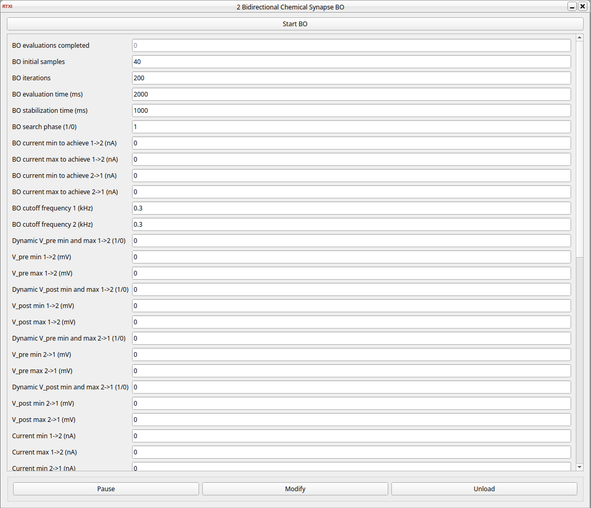

### Bidirectional chemical synapse bo

**Requirements:**

Third-party requirements are listed below:

| Requirement | Description | Version | Installation |
|---|---|---|---|
| [Limbo](https://github.com/resibots/limbo/releases/tag/v2.1.0) | Bayesian Optimization and Gaussian Processes library | v2.1.0 | **Git submodule**. In the `extern/limbo/` directory, run `git submodule update --init --recursive` from the root of the repository. |
| [KFR](https://github.com/kfrlib/kfr/releases/tag/7.0.1) | Digital signal processing library (low-pass filters like Butterworth, vectorized operations). Change the `-lkfr_dsp_...` flag from `avx2` to the appropriate one for your system in the Makefile. | 7.0.1 | **Manual pre-installation required** (must be compiled with `-DCMAKE_POSITION_INDEPENDENT_CODE=ON`) |
| [nlohmann/json](https://github.com/nlohmann/json/releases/tag/v3.11.3) | JSON serialization library (for the BO history) | v3.11.3 | **Vendored** (in the `include/nlohmann/` directory) |
| [NLopt](https://github.com/stevengj/nlopt/releases/tag/v2.7.1) | Optimization library (Subplex) | v2.7.1 | **Manual pre-installation required** |
| [Eigen3](https://eigen.tuxfamily.org) | C++ template library for linear algebra (required by Limbo) | | **Manual pre-installation required** |
| [Boost](https://www.boost.org) | C++ libraries (components: system, filesystem, thread) | | **Manual pre-installation required** |

**Limitations:** The user should change the `-lkfr_dsp_...` flag from `avx2` to the appropriate one for their system in the Makefile; and KFR DSP must be compiled with `-DCMAKE_POSITION_INDEPENDENT_CODE=ON`.



<!--start-->
The goal of this module is to automate the online parameterization of the **graded chemical synapse model by Golowasch et al.** [1] for biohybrid circuits, where biological neurons and computational models interact in real time. This model exhibits ***parameter sloppiness*** (multiple parameter combinations can yield similar outputs), making manual tuning difficult. It separates the synaptic current to enable modular and frequency-selective coupling:
- **Fast component**: presynaptic spikes (fast wave/high frequency).
- **Slow component**: presynaptic slow wave (low frequency).

#### Key features

- **Bayesian Optimization (BO)**: models the objective function using a **Gaussian Process (GP)**, configured with:
  - **Kernel**: **Squared Exponential Automatic Relevance Determination (SE-ARD)**; its hyperparameters are reoptimized using the **Resilient Backpropagation (Rprop)** algorithm.
  - **Initialization**: **Latin Hypercube Sampling (LHS)**.
  - **Acquisition function**: **Expected Improvement (EI)**; maximized via the **Subplex** algorithm.
- **Evaluation function** based on frequency decomposition of the presynaptic potential using a **low-pass filter (Butterworth)** to separate fast and slow components to use them as references. It independently assesses the **shape** (**Pearson correlation**) and **range** of each current component.
- **Parameter space handling**:
  - **Parameter sloppiness mitigation**:
    - **Reparameterizations**: `R = k2/k1`.
    - **Logarithmic scales**: conductances, `k1` and `R`.
    - **SE-ARD kernel**.
  - **Dynamic search bounds** adapted to each experiment's signal characteristics.

#### Implementation details

The codebase is written in **C++20**.

This implementation uses a **Runge-Kutta integrator** for solving the differential equations of the computational synaptic models. The integrator and the **models are self-implemented** to maximize efficiency, which is very important in hard real-time (e.g. calculating only the needed components of the equations).

It is a**RTXI 2.3** module that functions as a complete **synaptic module** for real-time interaction, not just a parameterization tool.

The module is designed to be used alongside the **RTHybrid for RTXI** modules to build the complete biohybrid setup.

It can operate in a **bidirectional** setup, **grouping the synapses in both directions** in the module to capture the whole dynamic in a evaluation. However, the user can **choose which current components** are used (calculated) and optimized in each direction, also to maximize efficiency. 

The optimization process typically requires **400 evaluations** (**50 initial samples** and **350 BO iterations**) to reach a good set of parameters, completing in under **16 minutes**.

To save the optimization history, you must set the `JSONL_HISTORY_FILE_PATH` environment variable when launching RTXI (e.g., `sudo JSONL_HISTORY_FILE_PATH="/path/to/history.jsonl" rtxi`).

##### Compilation

To compile and install the module for RTXI, run:

```bash
make
sudo make install
```

#### Related repositories

| Repository | Description |
|---|---|
| [tfg-data](https://github.com/marcogomezhernandez2004/tfg-data) | Data, plots, and scripts related to them. |
| [RTHybrid](https://github.com/GNB-UAM/RTHybrid/tree/a83071dcb4ac85f85b7beb2f7b7b5f68e785db22) (commit `a83071d`) | Standalone real-time neuronal model program by GNB. The presynaptic signal scaling algorithm is based on its implementation. |
| [rthybrid-for-rtxi](https://github.com/GNB-UAM/rthybrid-for-rtxi/tree/f13a015084b9819a02663833aaccbc8e86d36161) (commit `f13a015`) | RTXI modules that replicate RTHybrid functionality (neuronal models, burst analysis, amplitude scaling...), useful with the online synapse module. |
| [mimic-signal](https://github.com/RTXI/mimic-signal/tree/e15e26cef364575de9a0629591ac9e2218637226) (commit `e15e26c`) | RTXI module for applying gain and offset to a signal (for amplitude scaling), useful with the online synapse module. |
| [plugin-template](https://github.com/RTXI/plugin-template/tree/b7b3a3b606cca17778cac8c5a4846d6df8a0733a) (commit `b7b3a3b`) | Official RTXI module template. The legacy version of this template is used for compatibility with RTXI 2.3. |

#### License

Refer to the `LICENSE` files in each subdirectory.

#### References

[1] J. Golowasch, M. Casey, L. F. Abbott, and E. Marder, “Network stability from activity-dependent regulation of neuronal conductances,” Neural Computation, vol. 11, pp. 1079–1096, 07 1999.
<!--end-->

#### Input
1. input(0) - V_pre 1->2 (mV) : Presynaptic membrane potential 1->2
2. input(1) - V_post 1->2 (mV) : Postsynaptic membrane potential 1->2
3. input(2) - V_pre 2->1 (mV) : Presynaptic membrane potential 2->1
4. input(3) - V_post 2->1 (mV) : Postsynaptic membrane potential 2->1
5. input(4) - V_pre min 1->2 (mV) : Dynamic V_pre min 1->2
6. input(5) - V_pre max 1->2 (mV) : Dynamic V_pre max 1->2
7. input(6) - V_post min 1->2 (mV) : Dynamic V_post min 1->2
8. input(7) - V_post max 1->2 (mV) : Dynamic V_post max 1->2
9. input(8) - V_pre min 2->1 (mV) : Dynamic V_pre min 2->1
10. input(9) - V_pre max 2->1 (mV) : Dynamic V_pre max 2->1
11. input(10) - V_post min 2->1 (mV) : Dynamic V_post min 2->1
12. input(11) - V_post max 2->1 (mV) : Dynamic V_post max 2->1

#### Output
1. output(0) - Current 1->2 (nA) : Total synaptic current 1->2
2. output(1) - Current 2->1 (nA) : Total synaptic current 2->1

#### Parameters
1. BO initial samples - Number of initialization samples for BO
2. BO iterations - Number of BO iterations after initial sampling
3. BO evaluation time (ms) - Time to record signals per evaluation
4. BO stabilization time (ms) - Wait time after setting params before recording
5. BO search phase (1/0) - 1 = Enable, 0 = Disable
6. BO current min to achieve 1->2 (nA) - Target minimum current for direction 1->2
7. BO current max to achieve 1->2 (nA) - Target maximum current for direction 1->2
8. BO current min to achieve 2->1 (nA) - Target minimum current for direction 2->1
9. BO current max to achieve 2->1 (nA) - Target maximum current for direction 2->1
10. BO cutoff frequency 1 (kHz) - To separate the I_fast and I_slow for BO in synapse 1->2
11. BO cutoff frequency 2 (kHz) - To separate the I_fast and I_slow for BO in synapse 2->1
12. Dynamic V_pre min and max 1->2 (1/0) - 1 = Enable, 0 = Disable; necessary for BO
13. V_pre min 1->2 (mV) - Necessary for BO
14. V_pre max 1->2 (mV) - Necessary for BO
15. Dynamic V_post min and max 1->2 (1/0) - 1 = Enable, 0 = Disable; necessary for BO
16. V_post min 1->2 (mV) - Necessary for BO
17. V_post max 1->2 (mV) - Necessary for BO
18. Dynamic V_pre min and max 2->1 (1/0) - 1 = Enable, 0 = Disable; necessary for BO
19. V_pre min 2->1 (mV) - Necessary for BO
20. V_pre max 2->1 (mV) - Necessary for BO
21. Dynamic V_post min and max 2->1 (1/0) - 1 = Enable, 0 = Disable; necessary for BO
22. V_post min 2->1 (mV) - Necessary for BO
23. V_post max 2->1 (mV) - Necessary for BO
24. Current min 1->2 (nA) - Fixed output clamp min for current 1->2
25. Current max 1->2 (nA) - Fixed output clamp max for current 1->2
26. Current min 2->1 (nA) - Fixed output clamp min for current 2->1
27. Current max 2->1 (nA) - Fixed output clamp max for current 2->1
28. Verbose (1/0) - Enable/disable BO candidate evaluation logging
29. factor in dt (ms) = period (ms) * factor - Factor for calculating dt form the period; dt in ms
30. Use I_fast 1->2 (1/0) - 1 = Enable, 0 = Disable
31. Use I_slow 1->2 (1/0) - 1 = Enable, 0 = Disable
32. Use I_fast 2->1 (1/0) - 1 = Enable, 0 = Disable
33. Use I_slow 2->1 (1/0) - 1 = Enable, 0 = Disable
34. E_syn 1->2 (mV) - Synaptic reversal potential (1->2)
35. g_fast 1->2 (uS) - Fast conductance (1->2)
36. s_fast 1->2 (1/mV) - Fast sigmoid slope (1->2)
37. V_fast 1->2 (mV) - Fast sigmoid threshold (1->2)
38. g_slow 1->2 (uS) - Slow conductance (1->2)
39. k1 1->2 (1/ms) - Slow gating opening rate (1->2)
40. k2 1->2 (1/ms) - Slow gating closing rate (1->2)
41. s_slow 1->2 (1/mV) - Slow sigmoid slope (1->2)
42. V_slow 1->2 (mV) - Slow sigmoid threshold (1->2)
43. E_syn 2->1 (mV) - Synaptic reversal potential (2->1)
44. g_fast 2->1 (uS) - Fast conductance (2->1)
45. s_fast 2->1 (1/mV) - Fast sigmoid slope (2->1)
46. V_fast 2->1 (mV) - Fast sigmoid threshold (2->1)
47. g_slow 2->1 (uS) - Slow conductance (2->1)
48. k1 2->1 (1/ms) - Slow gating opening rate (2->1)
49. k2 2->1 (1/ms) - Slow gating closing rate (2->1)
50. s_slow 2->1 (1/mV) - Slow sigmoid slope (2->1)
51. V_slow 2->1 (mV) - Slow sigmoid threshold (2->1)

#### States
1. BO evaluations completed - Finishes when this is initial samples + iterations
2. I_fast 1->2 (nA) - Fast synaptic current component 1->2
3. I_slow 1->2 (nA) - Slow synaptic current component 1->2
4. I_fast 2->1 (nA) - Fast synaptic current component 2->1
5. I_slow 2->1 (nA) - Slow synaptic current component 2->1

